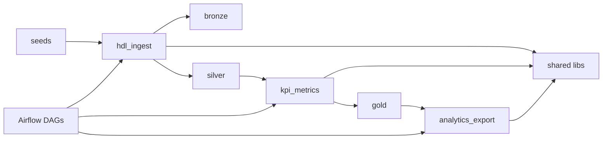

# data-platform

Portfolio **data platform monorepo**: shared libraries + multiple products (HDL / KPI / analytics), medallion lake (`landing → bronze → silver → gold`), Airflow orchestration, and GitHub Actions CI.

Inspired by enterprise platform patterns (shared utils, env configs, thin orchestration, DQ gates) — **100% greenfield / synthetic data**. No proprietary code.

## Architecture

```text
data-platform/
├── libs/                  # shared across all products
│   ├── platform_utils     # logging, retry, dates
│   ├── platform_dbutils   # LayerPaths, LakeIO, Spark helper
│   ├── platform_secrets   # env | AWS Secrets Manager
│   └── platform_dq        # null/range/volume checks
├── products/
│   ├── hdl_ingest         # landing → bronze → silver (+ is_current)
│   ├── kpi_metrics        # silver → gold KPIs
│   └── analytics_export   # gold + DQ → export
├── dags/                  # thin Airflow DAGs
├── conf/{local,dev,prod}  # env templates (no secrets)
├── seeds/                 # synthetic CSV
└── .github/workflows/ci.yml
```



## Quick start

```bash
# 1) install editable packages
make install

# 2) run full demo pipeline (no Docker required)
make demo

# 3) unit tests + DAG import check
make test
make dag-validate
```

Lake output lands under `./data/lake/local/{landing,bronze,silver,gold}/...`.

## Docker (Airflow + MinIO + Postgres + Spark)

```bash
cp .env.example .env
make up
# UI: http://localhost:8080  (admin / admin)
# MinIO: http://localhost:9001 (minioadmin / minioadmin)
```

DAGs: `hdl_ingest`, `kpi_metrics`, `analytics_export`.

## Products

| Product | Role |
|---------|------|
| `hdl_ingest` | Ingest synthetic orders into medallion layers |
| `kpi_metrics` | Compute demo KPIs into gold |
| `analytics_export` | DQ gate + consumption export |

## Cloud path (phase 2)

Templates in `conf/dev` and `conf/prod`:

- `LAKE_BACKEND=s3` + `LAKE_BUCKET=...`
- `PLATFORM_SECRETS_BACKEND=aws`
- example IAM policy: `conf/dev/iam-policy.example.json`

Spark optional: `pip install '.[spark]'` then `python scripts/submit_job.py`.

## Docs

- [Architecture](docs/architecture.md)
- [Lineage](docs/lineage.md)

## License

MIT — Victor Cappelletto
